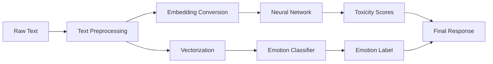

## Overview

The emotion prediction system is built as a Flask microservice that combines multiple machine learning models to analyze text for toxicity classification and emotion detection. The architecture consists of three main components:

1. **Flask Application Layer** - HTTP API server
2. **PyTorch Neural Network** - Deep learning model for toxicity classification
3. **Scikit-learn Classifier** - Traditional ML model for emotion prediction

## Application Stack

The microservice runs on:

```python
HOST = "127.0.0.1"
PORT = 3200
```

### Core Dependencies

- **Flask 2.2.2** - Web framework for HTTP endpoints
- **PyTorch 1.13.0** - Deep learning framework
- **scikit-learn 1.0.1** - Machine learning library
- **NLTK 3.7** - Natural language processing toolkit

<Info>
The application is configured with `JSON_AS_ASCII = False` to properly handle Unicode characters in text responses.
</Info>

## Model Components

### 1. PyTorch Deep Neural Network

The `base_line` model is a multi-layer perceptron that classifies text into 6 toxicity categories:

- Toxic
- Severe Toxic
- Obscene
- Threat
- Insult
- Identity Hate

```python
model = base_line(10, 6)  # 10-dimensional input, 6 outputs
model.load_state_dict(torch.load('models/model_26_87.12.pth'))
model.eval()
```

### 2. Word Embeddings

A 10-dimensional embedding layer converts words to numerical vectors:

```python
embedding = nn.Embedding(len(word_dict), 10)
```

<Tip>
The embedding dimension of 10 is relatively small, making the model lightweight and fast for production use.
</Tip>

### 3. Emotion Classifier

A pre-trained scikit-learn model loaded from pickle:

```python
emotion_classifier = pickle.load(open('models/emotion_classifier.model', 'rb'))
```

### 4. Text Vectorizer

Converts preprocessed text into feature vectors for the emotion classifier:

```python
vectorizer = pickle.load(open('models/vectorizer2.pickle', 'rb'))
```

## Processing Pipeline

The system processes incoming text through the following stages:



### Request Flow

1. **Input**: GET request to `/textbased_emotion?text=<input_text>`
2. **Preprocessing**: Text cleaning and lemmatization
3. **Parallel Processing**:
   - PyTorch model analyzes toxicity (6 binary classifications)
   - Scikit-learn model predicts emotion
4. **Output**: HTML template with all predictions

<Note>
The threshold for toxicity classification is set at 0.29. Scores above this value indicate the presence of that toxicity type.
</Note>

## Model Files

The application requires the following model artifacts:

| File | Purpose | Format |
|------|---------|--------|
| `model_26_87.12.pth` | Neural network weights | PyTorch state dict |
| `emotion_classifier.model` | Emotion classifier | Pickle |
| `vectorizer2.pickle` | Text vectorizer | Pickle |
| `word_dict.json` | Word-to-index mapping | JSON |

<Info>
The model filename `model_26_87.12.pth` suggests this is epoch 26 with 87.12% accuracy.
</Info>

## Additional Features

Beyond emotion prediction, the system extracts:

- **Dates** - Various date formats using regex patterns
- **Countries** - Using pycountry library
- **People Names** - Using NLTK POS tagging (NNP tags)
- **Time Ranges** - Hour ranges in format "HH:MM - HH:MM"

## API Endpoint

```python
@app.route('/textbased_emotion', methods=['GET'])
def predict_textbased_emotion():
    text = request.args.get('text')
    # Processing pipeline...
    return render_template('index.html', ...)
```

The endpoint returns an HTML response with all extracted information and predictions.